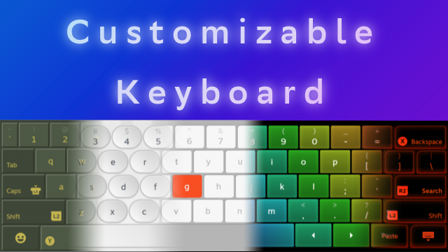

# 🎮 Steam Deck Customizable Keyboard

[](https://deckthemes.com/themes/view?themeId=0c5d6c86-ef3e-4af7-a041-34731a51fe7f)
[](https://deckthemes.com/themes/view?themeId=0c5d6c86-ef3e-4af7-a041-34731a51fe7f)
[](https://deckthemes.com/themes/view?themeId=0c5d6c86-ef3e-4af7-a041-34731a51fe7f)

A clean, modern, fully‑customizable keyboard theme for the Steam Deck.

> Your Steam Deck keyboard. But actually yours.

A CSS Loader plugin for restyle the Steam Deck on-screen keyboard — colors, key rounding, accents.
Built as a template: fork it, change variables, ship your own theme in minutes.

**16,000+ installs · 59 ⭐ on [DeckThemes](https://deckthemes.com/themes/view?themeId=0c5d6c86-ef3e-4af7-a041-34731a51fe7f)**



---

## ✨ Features

- 🎨 Color pickers in CSS Loader UI — no code editing needed
- 🔲 Key rounding presets (sharp / soft / pill)
- 🧱 CSS variable architecture — structured and easy to fork
- 📦 Drop-in install via Decky

---

## 📦 Installation

**Option A — Git**
```bash
cd ~/homebrew/themes
git clone https://github.com/KeeGooRoomiE/Steam-Deck-Keyboard-CSS-Loader-Template.git "Customizable Keyboard"
```

**Option B — Manual**  
Download → drag `Customizable Keyboard/` into `~/homebrew/themes/`

Then: **Decky → CSS Loader → Manage Themes → Enable "Customizable Keyboard"**

---

## 🍴 Make your own theme

1. Fork this repo
2. Edit CSS variables at the top of `keyboard.css`
3. Update name in `theme.json`
4. Drop in `~/homebrew/themes/` — done

---

## 📄 License

MIT — fork it, remix it, ship it.
