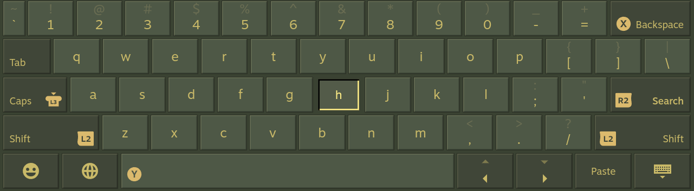
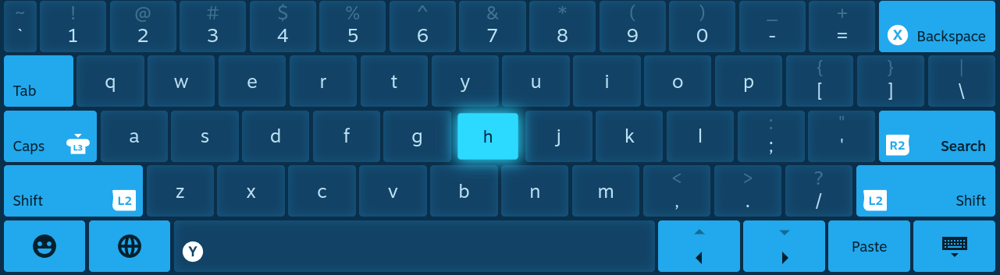
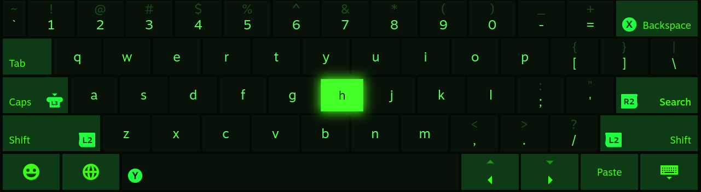
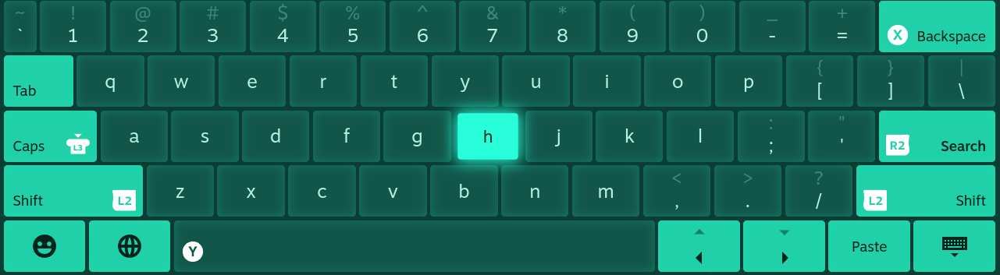
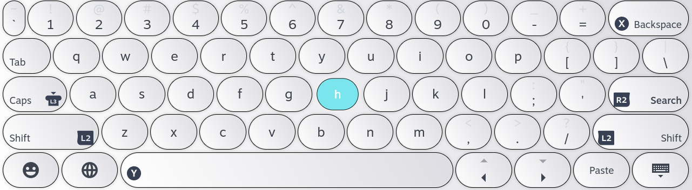
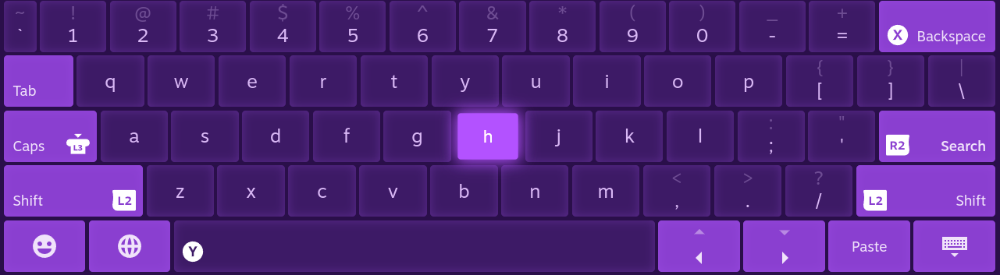
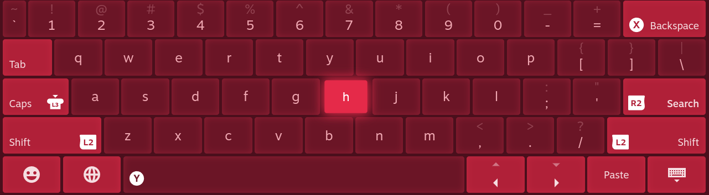
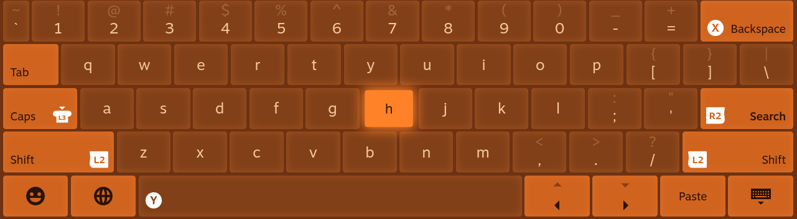
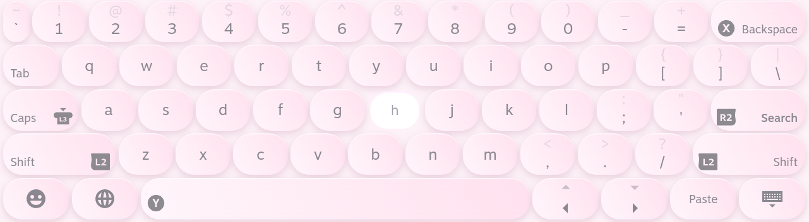
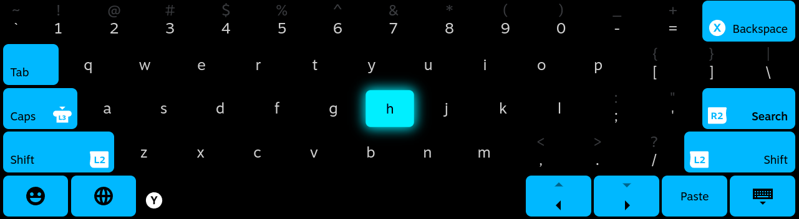

# 🎮 Steam Deck Customizable Keyboard

[](https://deckthemes.com/themes/view?themeId=0c5d6c86-ef3e-4af7-a041-34731a51fe7f)
[](https://deckthemes.com/themes/view?themeId=0c5d6c86-ef3e-4af7-a041-34731a51fe7f)
[](https://deckthemes.com/themes/view?themeId=0c5d6c86-ef3e-4af7-a041-34731a51fe7f)

A clean, modern, fully‑customizable keyboard theme for the Steam Deck.

> Your Steam Deck keyboard. But actually yours.

A CSS Loader theme that restyles the Steam Deck on-screen keyboard — colors, key rounding, accents.
Built as a template: fork it, change variables, ship your own theme in minutes.

See it on [DeckThemes](https://deckthemes.com/themes/view?themeId=0c5d6c86-ef3e-4af7-a041-34731a51fe7f)


---

## ✨ Features

- 🎨 **13 hand-tuned presets** — colours, corner radius, glow, and function-key style are baked into
  each one individually:
  - Inspired by Steam Points Shop keyboards: **Steam Green · Spectrum · Cerulean · Digital · Seafoam ·
    Candy Coded · Grape · Ruby · Pumpkin · OLED · Limited Edition White**
  - Plus **One Dark Style** and **OLED Black**
- 🌈 Real per-key effects, not just flat recolours — Spectrum's rainbow gradient (with an authentic
  per-row offset), Candy Coded's glossy gradient keycaps, OLED's inner glow, Steam Green's raised
  bevel with an inverted pressed state — all from the same small set of CSS variables
- 🎛️ Two global controls in the CSS Loader UI: **Press animation** (on/off) and **Function keys**
  (accent / neutral)
- 🖌️ Full **Custom** mode — 9 colour pickers for every part of the keyboard, no code
- 🧱 CSS-variable architecture, verified live against the real Steam keyboard DOM
  (see [`docs/keyboard-anatomy.md`](docs/keyboard-anatomy.md))
- 📦 Drop-in install via Decky

> The Points Shop–inspired presets are colour recreations tuned by hand against the official art —
> not the original gradient/glow themes pixel-for-pixel.

---

## 📦 Installation

**Option A — CSS Loader store (recommended)**
Decky → **CSS Loader** → **Browse Themes** → search **Customizable Keyboard** → download.
Then enable it under **Manage Themes** and pick a preset.

**Option B — Git**
```bash
cd ~/homebrew/themes
git clone https://github.com/KeeGooRoomiE/Steam-Deck-Keyboard-CSS-Loader-Template.git "Customizable Keyboard"
```

**Option C — Manual**
Download → drag `Customizable Keyboard/` into `~/homebrew/themes/`

For B and C: **Decky → CSS Loader → Manage Themes → Enable "Customizable Keyboard"**

---

## 🍴 Make your own theme

1. Fork this repo
2. Edit CSS variables at the top of `keyboard.css`
3. Update name in `theme.json`
4. Drop in `~/homebrew/themes/` — done

---

## 🖼️ Preset gallery

<sub>Captured on-device. The <kbd>h</kbd> key is shown pressed in every shot.</sub>

| | |
|---|---|
| **Steam Green**<br> | **Spectrum**<br> |
| **Cerulean**<br> | **Digital**<br> |
| **Seafoam**<br> | **Candy Coded**<br> |
| **Grape**<br> | **Ruby**<br> |
| **Pumpkin**<br> | **OLED**<br> |
| **Limited Edition White**<br> | **Marshmallow**<br> |
| **One Dark Style**<br> | **OLED Black**<br> |

---

## 📄 License

MIT — fork it, remix it, ship it.
